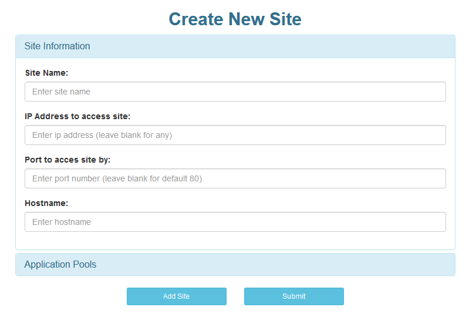
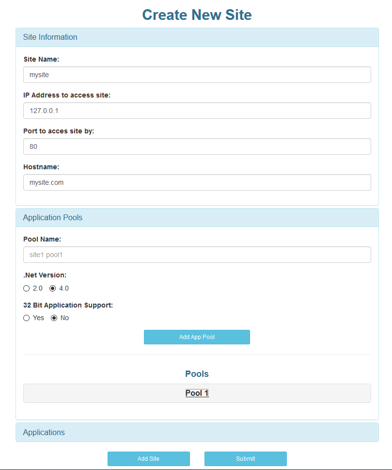
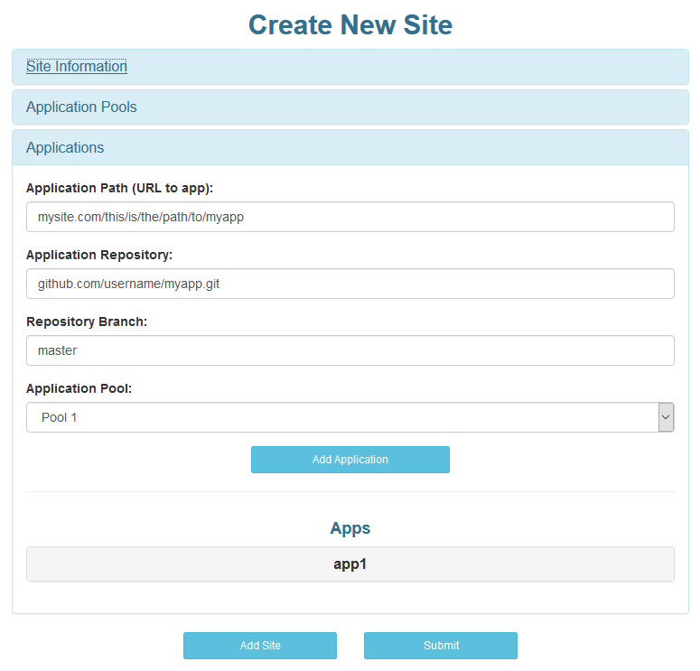
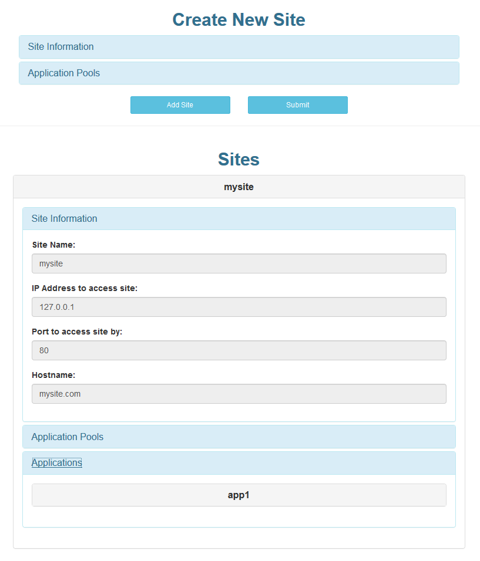

# Ansible IIS Webserver Demo

## Purpose
The code within is divided into two section. First is a simple PHP based website that retrieves user input regarding website information. This info is grabbed, written to a YAML file, and then passed to Ansible which handles the actual logic of setting up the web server. The Ansible output is written to a `test/results/output`. It can be checked for any inconsistencies.

## How To Use
Once the website is availble on a Unix box, users will be greeted with a form to create a new site. It will look as follows:

Users can add general site information in this first panel. For now add an IP address and keep the port at 80.

Following this, users can add information about application pools. Ensure your application pool names are valid according to IIS. Clicking the add pool button will save the pool to your site and its info will be displayed in a nested panel below the button.

Upon adding a pool, a third panel will be available where users can enter application information. The process here is just like with the application pools. Fill in the relevant information and click add app to confirm the addition. Be sure to provide the url you want to reach your app at for the app path box.

Once users have added the information they want for a website, clicking the add site button will save the site. You can review the information about it a new panel that will show up below the main form.

Finally, once users have all of their website information filled out, click the submit button to confirm. This will generate the YAML file that will be used to configure your IIS webserver automatically. Currently this site does not serve the YAML file back to the client, but this could be easily added. Also not that the site currently does not refresh itself, so please ensure you refresh the page before attempting another query.

## Limitations
The Ansible code assumes a particular destination server currently. Thus, the hosts file and group_vars files must be altered to run this playbook on a different server.

Additionally, some of the website seems to have issues in Chrome but works fine in Firefox. I've not yet made it cross platform. Please be sure to use Firefox for now.

## Future Work
1. Currently the website does not offer highly restrictive form monitoring to guarantee an acceptable YAML file is produced. Checking for valid input is a need in the future.
2. The current implementation does not involve server creation itself. In the future this could be attached to a Cloud Formation template to both deploy a server and configure the IIS Webserver on the box itself.
3. There are arguably some areas to improve efficiency. The website for example could process more things server side rather than client side via JavaScript. 
4. The Ansible code currently uses a few work arounds as the Windows management modules are not fully featured yet. It would be preferable to switch to supported modules in the future when they can accommodate the same tasks.